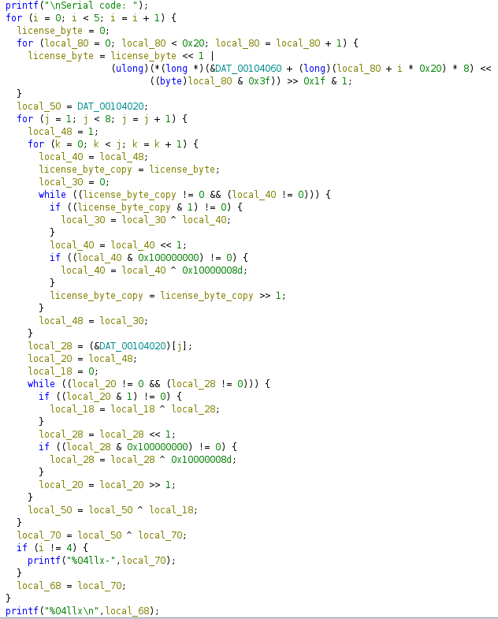

# leaked_license

The binary generates a serial code from a license generated via a quite complex algorithm involving xor and shifts.

Objective: find the serial code associated to another license, `726cfc2d26c6defedb06562199f5c7d0da4f4930`.

The license generated is of course always the same, so we have just the serial code associated to that license, not the one we need.

The code it's a mess and renaming the variables doesn't help much.

## Solution

The obvious way to solve the challenge is to reverse the algorithm and find the serial code associated to the license we have. But this is very hard.

The fastest and easiest solution is to use GDB to set at runtime the bytes of the license to the ones we have and then let the program generate the serial code for us. In this way we don't need to reverse the algorithm.

1) Set a breakpoint to an instruction in the outer loop outside the nested loops: `b *0x5555555552c0`. This instruction is the `local_50 = DAT_00104_020;` in the decompiled code, disassembled as `qword ptr [rbp - 0x48]`. From Ghidra we know that the license chunk is right before that variable in the stack so at the address `rbp - 0x50`
2) Use `c` to continue the execution until the breakpoint is reached
3) At each iteration of the loop modify the license chunk with the right bytes with `set *(char **)($rbp - 0x50) = 0x726cfc2d` (the first chunk of the license, in this case)
4) Continue from point 2 until the end of the loop

At the end of the loop the output will be the serial code we are looking for.
